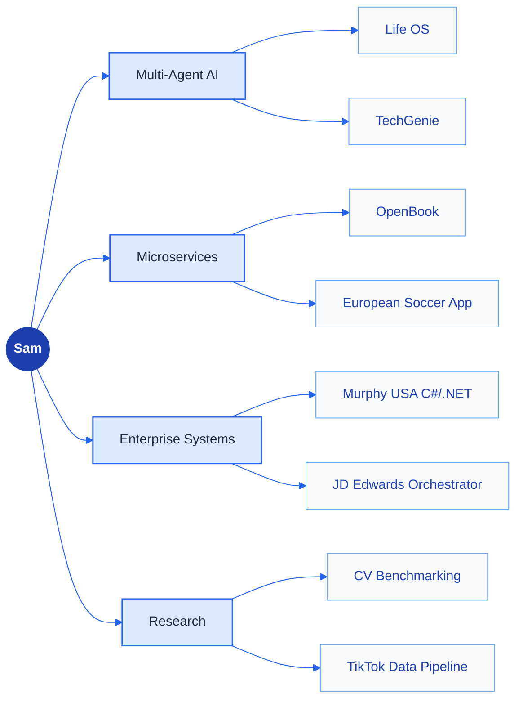

<!-- ┌──────────────────────────────────────────────────────────────────────┐ -->
<!-- │   samin1554 · profile readme                                         │ -->
<!-- │   Concept: a curated exhibition, adapted for Sam.                    │ -->
<!-- │   canvas #F8FAFC · cobalt #1E40AF · cerulean #2563EB                 │ -->
<!-- │   sky #60A5FA · pale #DBEAFE · ochre #FBBF24                         │ -->
<!-- └──────────────────────────────────────────────────────────────────────┘ -->

<div align="center">

<!-- ░░ HERO — swap this for a custom-painted masthead if you have one; capsule-render used as a drop-in ░░ -->


</div>

<br/>

> "I don't just ship features — I architect the systems underneath them."
> Twelve agents, six microservices, one goal: turn a hard problem into something that just runs.
>
> *Build the system. Then get out of its way.*

<br/>

<div align="center">
  
</div>

## ▍ 01 — Identity

```yaml
name:        Sayed Amin
handle:      samin1554  ·  github.com/samin1554
title:       Full-Stack Developer / Multi-Agent AI Builder
location:    San Bernardino, CA
education:   B.S. Computer Science & Mathematics, UC San Bernardino (GPA 4.0, exp. 2027–2028)
languages:   [Java, Python, TypeScript, JavaScript, C#, Go]
domains:
  - Multi-agent AI systems       # Life OS — 12-agent LangGraph orchestration
  - Microservices architecture   # OpenBook — 6-service RAG platform
  - Enterprise integration       # Murphy USA — C#/.NET, JD Edwards, AS400
  - AI career tooling            # TechGenie — full-stack SaaS
  - Applied research             # CV benchmarking, TikTok data pipelines
strengths:
  - Architect distributed systems end-to-end (microservices, event-driven, RAG).
  - Orchestrate multi-agent LLM systems with real memory, not just prompts.
  - Ship production tooling inside legacy enterprise stacks (JD Edwards, IBM i/AS400).
  - Move fluidly between research code and shipped, deployed products.
mantra:      "Strive not to be a success, but rather to be of value."
```

<br/>

<div align="center">
  
</div>

## ▍ 02 — Arsenal

<div align="center">

[](https://skillicons.dev)

[](https://skillicons.dev)

[](https://skillicons.dev)

</div>

<br/>



<br/>

<div align="center">
  
</div>

## ▍ 03 — Signature Work

<sub>One flagship, four companions.</sub>

<br/>

<!-- ╔══ FLAGSHIP — Life OS ══╗ -->

<div align="center">
  
</div>

<table>
<tr>
<td valign="middle">

### `01` &nbsp; Life OS &nbsp;·&nbsp; Multi-Agent AI Life Coach

> A **12-agent LangGraph orchestration system** that acts as a personal life coach — learning behavioral patterns and actively handling the tasks you keep avoiding: drafting emails, building realistic daily plans, generating documents, and collapsing overwhelming days into exactly 3 things. Backed by ChromaDB semantic memory, Gmail OAuth, and BYOK support across 9 LLM providers.

<sub>*Next.js · FastAPI · LangGraph · PostgreSQL · ChromaDB · Redis · Clerk — 2026*</sub>
<br/><sub>Site no longer live due to VPC hosting costs — code available on request.</sub>

<a href="https://github.com/samin1554/Life-os">
  
</a>

</td>
</tr>
</table>

<br/>

<!-- ╔══ COMPANIONS — 2×2 gallery ══╗ -->

<table>
<tr>

<td width="50%" valign="top">

<div align="center"></div>

#### `02` &nbsp; OpenBook &nbsp;·&nbsp; Open-Source NotebookLM Clone

A **6-service Java/Spring Boot microservices platform** for RAG-powered document Q&A, built over 8 weeks. pgvector + LLaMA 3.3 70B retrieval, event-driven RabbitMQ messaging, async podcast generation (67 TTS voices), mind maps, slide decks, and Stripe billing.

<sub>*Spring Boot · FastAPI · React · TypeScript · pgvector · RabbitMQ · Docker · Stripe — 2026*</sub>

<a href="https://github.com/samin1554/OpenBook">Enter the repo →</a>

</td>

<td width="50%" valign="top">

<div align="center"></div>

#### `03` &nbsp; TechGenie &nbsp;·&nbsp; AI Career Toolkit for Developers

A full-stack SaaS platform deployed at techgenie.cc: GitHub profile analysis across 7 dimensions, ATS-optimized resume generation, cover letters, skill-gap analysis, LinkedIn optimization, and live job listings via the JSearch API (LinkedIn, Indeed, Glassdoor).

<sub>*Next.js · FastAPI · PostgreSQL · OAuth2 · Stripe · Vercel · Railway — 2026*</sub>

<a href="https://github.com/samin1554/TechGenie">Enter the repo →</a>

</td>

</tr>
<tr>

<td width="50%" valign="top">

<div align="center"></div>

#### `04` &nbsp; European Soccer Web App

A full-stack app pairing a TypeScript frontend with a Java/Spring Boot backend — league data, standings, and match browsing across a clean client/server split.

<sub>*TypeScript · Java · Spring Boot · HTML/CSS — 2026*</sub>

<a href="https://github.com/samin1554/European-Soccer-Web-App">Enter the repo →</a>

</td>

<td width="50%" valign="top">

<div align="center"></div>

#### `05` &nbsp; Fitness App

A confirmed full-stack fitness-tracking app: Spring Boot backend serving a React frontend for logging workouts and tracking progress over time.

<sub>*Java · Spring Boot · React · JavaScript — 2026*</sub>

<a href="https://github.com/samin1554/Fitness-App">Enter the repo →</a>

</td>

</tr>
</table>

<br/>

<div align="center">
  <a href="https://github.com/samin1554?tab=repositories">
    
  </a>
</div>

<br/>

<div align="center">
  
</div>

## ▍ 04 — Experience

<sub>Where the systems thinking gets stress-tested against real production constraints.</sub>

<br/>

<table>
<tr>
<td width="100%" valign="top">

#### Software Engineering Intern &nbsp;·&nbsp;  &nbsp;·&nbsp; <sub>Jun–Jul 2026</sub>

Built a **C# / .NET integration solution from scratch** to replace legacy SnapLogic pipelines for the Financial Systems team's invoice, PO, and transaction processing. Engineered validation queries against **IBM i (AS400) DB2** tables to surface incorrect POs across systems. Redesigned a **JD Edwards Orchestrator workflow** with custom sub-orchestrations, writing validation logic in **JRuby / Ruby on Rails** to catch corrupted and blank data. Built an **Azure DevOps CI/CD pipeline** in YAML that auto-generates bug tickets and triggers test runs on new commits.

</td>
</tr>
<tr>
<td width="100%" valign="top">

#### Undergraduate Research Assistant &nbsp;·&nbsp;  &nbsp;·&nbsp; <sub>2025–Spring 2026</sub>

Ran comparative computer vision research benchmarking **VGG16, ViT, ChatGPT, and Claude** on a 4-class image classification task, evaluating models via IoU and accuracy.

</td>
</tr>
<tr>
<td width="100%" valign="top">

#### Research Assistant &nbsp;·&nbsp;  &nbsp;·&nbsp; <sub>May–Jul 2024</sub>

Built Python pipelines to scrape and process **5,000+ TikTok posts** on oral nicotine products, with validation logic ensuring **99% data consistency** across heterogeneous sources.

</td>
</tr>
</table>

<br/>

<div align="center">
  
</div>

## ▍ 05 — Open Source

<sub>Fixes and features contributed to codebases beyond my own.</sub>

<br/>

<table>
<tr>

<td width="33%" valign="top">

#### Notte &nbsp;·&nbsp; <a href="https://github.com/nottelabs/notte">nottelabs/notte</a>

Designed and implemented **prefix-based model validation** for LLM provider integration, addressing a maintainer-identified gap in the architecture.

</td>

<td width="33%" valign="top">

#### Hermes Agent &nbsp;·&nbsp; <a href="https://github.com/NousResearch/hermes-agent">NousResearch/hermes-agent</a>

Added a **semantic-scholar research skill** covering 9 API endpoint types, closing a documented gap next to the existing arxiv skill.

</td>

<td width="33%" valign="top">

#### JavaScript Mastery Pro &nbsp;·&nbsp; <a href="https://github.com/JavaScript-Mastery-Pro">JavaScript-Mastery-Pro</a>

Fixed a missing `await` on a Mongoose `findOneAndUpdate` call that left a Promise unresolved in a POST handler. **Merged.**

</td>

</tr>
</table>

<br/>

<div align="center">
  
</div>

## ▍ 06 — Telemetry

<sub>Live readouts, not static numbers — every widget below pulls fresh on each page load.</sub>

<br/>

<div align="center">

&nbsp;&nbsp;
&nbsp;&nbsp;


</div>

<br/>

<table>
<tr>
<td width="50%" valign="top">

<div align="center"><sub>▸ STATS AT A GLANCE</sub></div>


</td>
<td width="50%" valign="top">

<div align="center"><sub>▸ LANGUAGE MIX</sub></div>


</td>
</tr>
</table>

<br/>

<div align="center">

<sub>▸ CURRENT STREAK</sub>
<br/>


</div>

<br/>

<div align="center">

<sub>▸ CONTRIBUTION ACTIVITY</sub>
<br/>


</div>

<br/>

<div align="center">

<sub>▸ ACHIEVEMENTS</sub>
<br/>


</div>

<br/>

<div align="center">
  
</div>

## ▍ 07 — Reach

<div align="center">

<a href="https://github.com/samin1554">
  
</a>
<a href="mailto:Samiul27a@gmail.com">
  
</a>
<a href="https://github.com/samin1554?tab=repositories">
  
</a>

<br/><br/>

<sub>Open to collaborate on multi-agent AI systems · full-stack SaaS · enterprise integrations. Email me directly.</sub>

</div>

<br/>

<div align="center">
  
  <sub><i>"Strive not to be a success, but rather to be of value." – Albert Einstein</i></sub>
</div>
